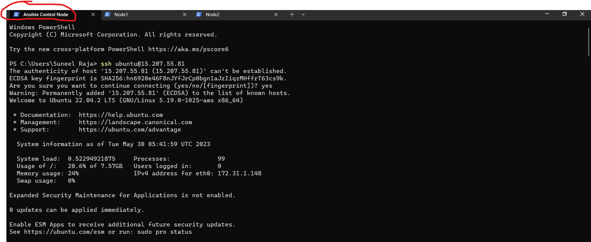
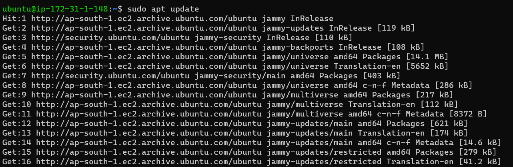
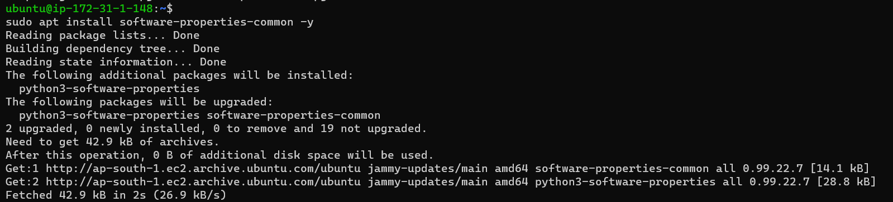
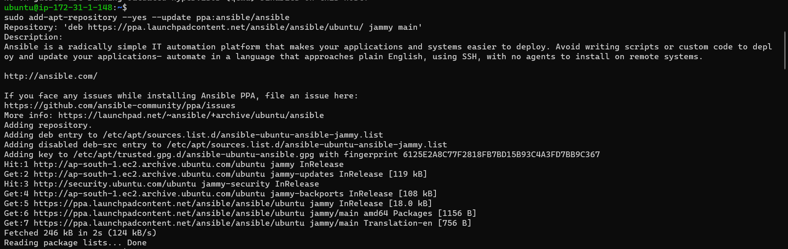
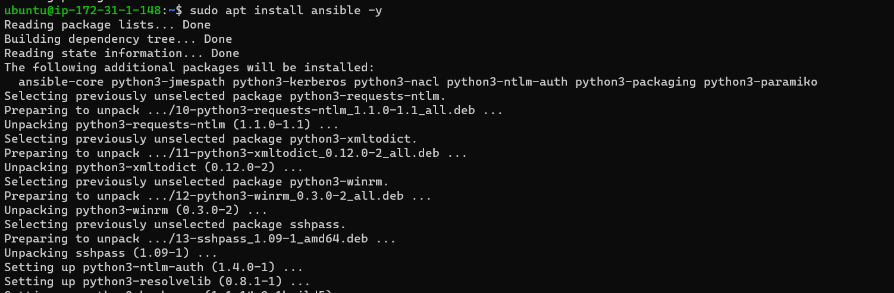
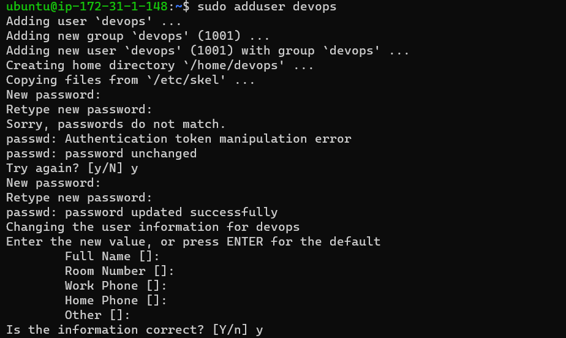
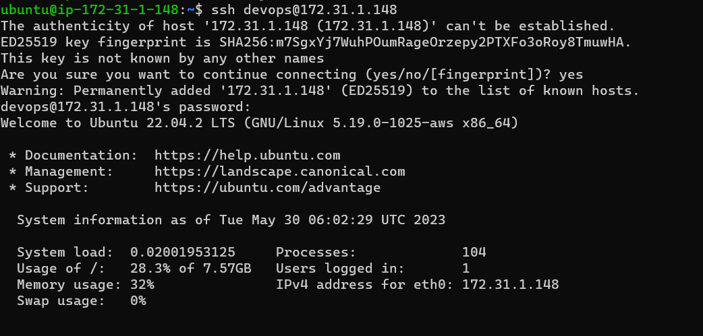

#                 Ansible controlNode and Node configuration

---

Step1:
---

- Start two instance on aws .

    Connect to the linux machine and run the

  

---


Step2
---
- Open the Terminal window with Ansible Control Node Tab

- Connect with ubuntu machine with ip address using the following command

        ssh ubuntu@ip



---

Step 3

 Connect the ubuntu machine with ip address using the following command


   ``` Sudo apt update``` 
    
(system tracks changes to each package when a new 
            version is released.)

---



---

Step 4

- Follow the steps for installing installing ansible in the control node

         sudo apt update
         sudo apt install software-properties-common -y
         sudo apt install ansible -y
         sudo add-apt-repository --yes --update ppa:ansible/ansible




---

---



---

---



---

---

Step 5:

### Add the user in the present machine 

- By using Sudo module we can add user  with same name  in the three different machines 
```
 sudo adduser devops
```



---

---

Step 6: 


- Give the user acesss permissions using visudo admin module


---

Step7:

Configure the sshd file using the following command

         sudo vi /etc/ssh/sshd-config
---


---
Step 8:


- Connect the machine with user we have created for example user name is devops using the  following command

        ssh devops@ip


---



---

Step 9:

Then exit from the user for checking purpose
---


---
Step 10:

- Again connect to the machine from another node1

---


---

---

Step 11:

Generate Keygen for the users to connect 


---

---
Step 12: 

- Check the directory for the SSH key
by using the following commad

```
cd ./.ssh/

```
Step 13

- check the directory of ssh 


---

Step 14:


- Copy the ssh- key id to the diffent node 

---


---

---
Step 15:

Copy the ssh- key id to the diffent node from Redhat


---

---
Step 16:

- check the directory


---

---

Step 17:

- Ping all the hosts by giving the following commands

    ```ansible -m ping -i host all```


---

Step 18:
 
 - edit the inventory files with diffrent nodes and save with the following command

 ``` sudo vi/home/devops/host ```
---


---

---

Installation Successfull

---


---


